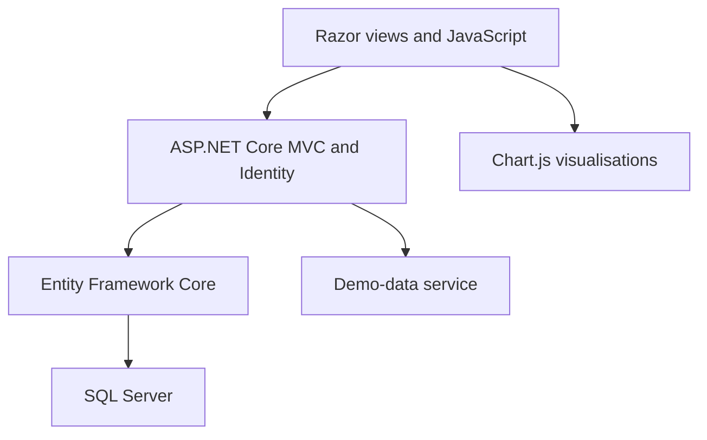

# Expense Tracker

[](https://github.com/DeanProgramming/ExpenseTracker/actions/workflows/main_expensetracker-deanh.yml)
[](https://dotnet.microsoft.com/)
[](https://expensetracker-deanh.azurewebsites.net/)

**Expense Tracker** is a full-stack personal-finance application built with **ASP.NET Core MVC**. It combines authenticated expense management with an interactive dashboard that helps users understand where their money goes each month.

Users can create, edit, and delete transactions directly from the dashboard. **Chart.js** visualisations update immediately after each change, making it easy to compare category spending for the selected month with longer-term monthly averages.

## Live Demo

**[Open Expense Tracker](https://expensetracker-deanh.azurewebsites.net/)**

Use the shared portfolio account to explore the application with fictional data:

| Field | Demo value |
| --- | --- |
| Email | `test@example.com` |
| Password | `Test@123` |

The application uses Azure services that may enter an idle state, so the first request can take a little longer. The demo account is shared and its data may change between visits. Select **Regenerate Demo Data** to restore a fresh rolling sample; manual regeneration has a two-minute cooldown.

## Overview

Expense Tracker presents spending as both individual transactions and category-level trends. The dashboard opens on the current month, displays each recorded expense in an editable table, and generates separate charts for earlier months. Selecting another month updates both the transaction panel and the main chart without navigating away.

The application uses **SQL Server** through **Entity Framework Core**, **ASP.NET Core Identity** for account management, and a JavaScript-driven interface for in-place CRUD operations and chart refreshes. A GitHub Actions workflow builds and publishes the application before deploying it to **Azure App Service**.

## Features

### Account access

- Registration and sign-in with ASP.NET Core Identity
- Expenses associated with the signed-in account
- Shared portfolio account containing fictional demonstration data

### Expense management

- Add expenses with a description, amount, date, and category
- Edit existing transactions from the selected month's table
- Delete transactions through a timed confirmation step
- Validate required fields and reject non-positive amounts
- Refresh the dashboard after changes without a full-page reload

### Interactive spending dashboard

- Category breakdown for the currently selected month
- Individual charts for previously recorded months
- Average monthly spending by category from the available data
- Consistent category colours across every chart
- Month selection that updates the chart and editing panel together
- Transaction tables ordered with the newest expenses first

### Demo-data regeneration

- Automatically create rolling sample data when the current month is empty
- Manually reset the signed-in account's expenses from the dashboard
- Populate several months of realistic, fictional transactions
- Apply a two-minute in-memory cooldown to repeated manual requests

## Core Workflows

### 1. Sign in or create an account

Visitors can use the shared demo credentials or register a separate account. ASP.NET Core Identity manages the account and sign-in flow.

### 2. Review a month

The dashboard groups transactions by calendar month and category. The main pie chart shows the selected month's breakdown, while historical month cards make comparisons quick.

### 3. Manage transactions in place

Create and edit forms open inside the dashboard. Successful changes update the browser's data model, transaction table, selected-month chart, historical charts, and average chart immediately.

### 4. Restore sample data

The regeneration service can replace the current account's transactions with a rolling fictional dataset, keeping the public demonstration useful even after visitors have edited it.

## System Architecture



The application is organised into the following areas:

1. **Presentation layer**
   - Razor views and responsive CSS
   - JavaScript-generated forms and transaction tables
   - Chart.js pie charts for monthly and average category spending

2. **Application layer**
   - MVC controllers for dashboard requests and expense operations
   - Demo-data service for rolling fictional transactions and regeneration limits
   - Server-side model validation and request orchestration

3. **Data and identity layer**
   - Entity Framework Core for persistence
   - SQL Server for application and Identity data
   - ASP.NET Core Identity user records and relationships
   - EF Core migrations for schema evolution

## Technology Stack

| Area | Technology |
| --- | --- |
| Web application | .NET 9, ASP.NET Core MVC, Razor Views |
| Authentication | ASP.NET Core Identity |
| Data access | Entity Framework Core 9 |
| Database | SQL Server; LocalDB for the default local setup |
| Front end | HTML, CSS, JavaScript, Bootstrap |
| Visualisation | Chart.js 2.9.4 |
| Delivery | GitHub Actions and Azure App Service |

## Data Model Highlights

| Entity | Responsibility |
| --- | --- |
| `User` | Identity account with a collection of expenses |
| `Expense` | Description, positive amount, transaction date, owner, and category |
| `Category` | Reusable spending category assigned to expenses |

The database is pre-seeded with core categories. The demo-data service adds the wider set used by its generated transactions, including rent, groceries, coffee, utilities, entertainment, subscriptions, shopping, education, and miscellaneous spending.

## Implementation Highlights

- Asynchronous EF Core queries and persistence for the main expense workflow
- SQL Server retry handling for transient database failures
- Anti-forgery tokens on create, edit, and delete forms
- Server-side validation for required fields, dates, categories, and positive amounts
- HTML escaping before transaction data is inserted into JavaScript-generated markup
- Automatic recalculation of all affected charts after an in-place change
- Optional migration-on-startup behaviour through application configuration

## Build and Deployment

The GitHub Actions workflow runs on pushes to `main` and can also be started manually. It:

1. restores and builds the .NET application in Release configuration
2. publishes a deployable application artifact
3. authenticates to Azure using OpenID Connect
4. deploys the artifact to Azure App Service

The workflow's current scope is build and deployment; an automated test project has not yet been added.

## Running the Project Locally

### Prerequisites

- [.NET 9 SDK](https://dotnet.microsoft.com/download/dotnet/9.0)
- SQL Server or SQL Server LocalDB
- [`dotnet-ef`](https://learn.microsoft.com/ef/core/cli/dotnet) command-line tool

### 1. Clone and restore

```bash
git clone https://github.com/DeanProgramming/ExpenseTracker.git
cd ExpenseTracker
dotnet restore
```

### 2. Configure the database connection

The included development configuration targets SQL Server LocalDB on Windows. To keep environment-specific settings outside source control, set the connection string with .NET user secrets:

```bash
dotnet user-secrets set "ConnectionStrings:DefaultConnection" "Server=(localdb)\MSSQLLocalDB;Database=ExpenseTracker;Trusted_Connection=True;MultipleActiveResultSets=true" --project ExpenseTracker/ExpenseTracker.csproj
```

Use an appropriate SQL Server connection string on systems without LocalDB. Do not commit credentials to `appsettings.json`.

### 3. Apply migrations

```bash
dotnet ef database update --project ExpenseTracker/ExpenseTracker.csproj --startup-project ExpenseTracker/ExpenseTracker.csproj
```

### 4. Run the application

```bash
dotnet run --project ExpenseTracker/ExpenseTracker.csproj
```

Open the HTTPS address printed by ASP.NET Core in the terminal.

## Configuration

| Setting | Purpose | Required |
| --- | --- | --- |
| `ConnectionStrings:DefaultConnection` | SQL Server connection string used by EF Core and Identity | Yes |
| `RunMigrationsOnStartup` | Applies pending EF Core migrations during application startup when set to `true` | No |

## Project Structure

| Path | Contents |
| --- | --- |
| `ExpenseTracker/Areas/Identity` | Registration, login, and account pages |
| `ExpenseTracker/Controllers` | MVC request handling and expense operations |
| `ExpenseTracker/Data` | EF Core context and database migrations |
| `ExpenseTracker/Models` | User, expense, and category entities |
| `ExpenseTracker/Services` | Demo-data creation and regeneration workflow |
| `ExpenseTracker/Views` | Razor views for the dashboard and shared layout |
| `ExpenseTracker/wwwroot/css` | Application and dashboard styling |
| `ExpenseTracker/wwwroot/js` | In-place CRUD behaviour and chart coordination |
| `.github/workflows` | Azure build and deployment workflow |

## Current Limitations and Next Steps

This repository is a focused portfolio application rather than a complete personal-finance platform. The main next steps are:

- add unit, integration, and browser-level tests, then run them before deployment
- make the shared demo read-only while retaining a separate resettable sandbox
- centralise per-user ownership checks across every expense operation

## Author

Built by **Dean Holland** as a personal software-development portfolio project.

GitHub: [DeanProgramming](https://github.com/DeanProgramming)
