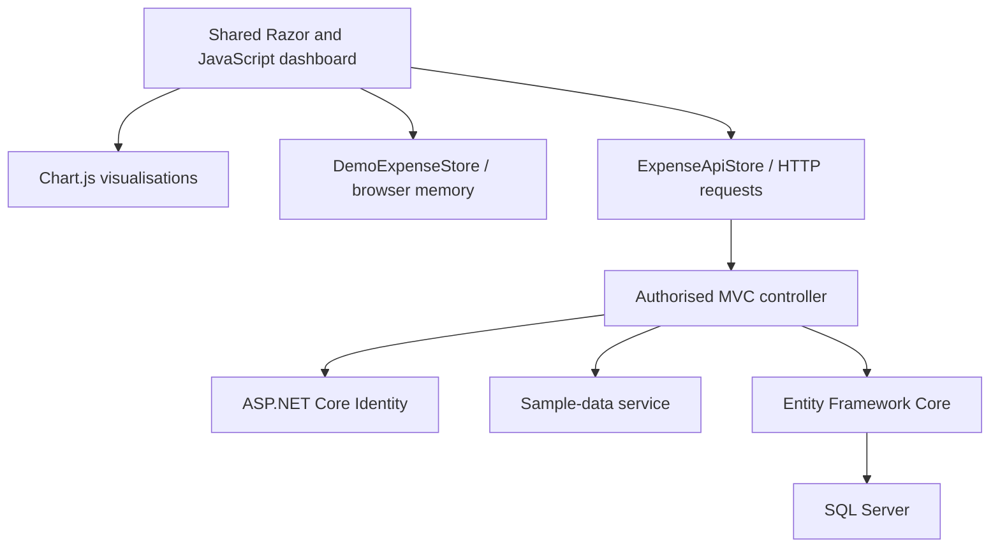

# Expense Tracker

[](https://github.com/DeanProgramming/ExpenseTracker/actions/workflows/main_expensetracker-deanh.yml)
[](https://dotnet.microsoft.com/)
[](https://expensetracker-deanh.azurewebsites.net/)

**Expense Tracker** is a full-stack personal-finance application built with **ASP.NET Core MVC**. It combines an isolated, browser-only public demo with authenticated, SQL-backed expense management.

Users can create, edit and delete transactions from an interactive monthly dashboard. **Chart.js** visualisations update immediately after each change, making it easy to compare category spending for a selected month with historical data and monthly averages.

## Live Demo

**[Open the interactive demo](https://expensetracker-deanh.azurewebsites.net/Demo)**

No account or shared credentials are required. The demo provides fictional rolling expense data and supports creating, editing, deleting and regenerating transactions entirely within the current browser tab.

Demo mutations are never sent to the server, Identity system or database. Refreshing the page restores a fresh copy of the original dataset.

The Azure-hosted application may take a little longer to respond to the first request after being idle. Register or sign in if you want your own expenses to persist between visits.

## Overview

Expense Tracker provides two deliberately separated dashboard modes:

| Route       | Access        | Storage and behaviour                                                                               |
| ----------- | ------------- | --------------------------------------------------------------------------------------------------- |
| `/Demo`     | Public        | Uses a deterministic fictional dataset. Changes remain in browser memory and reset on refresh.      |
| `/Expenses` | Authenticated | Loads and persists only the signed-in user's expenses through Entity Framework Core and SQL Server. |

Both modes use the same responsive Razor dashboard and chart-rendering code. Separate JavaScript stores keep the public demo disconnected from the authenticated mutation endpoints.

Anonymous visitors opening the application root are redirected to the interactive demo. Signed-in users are redirected to their persistent expense dashboard.

## Features

### Public interactive demo

* No registration or sign-in required
* Fresh fictional data covering the current month and previous three months
* Create, edit and delete expenses inside the browser
* Regenerate the original dataset after making changes
* No shared Identity account, database writes or server-side mutation routes
* Automatic reset when the page is refreshed

### Account access

* Registration and sign-in through ASP.NET Core Identity
* Persistent expenses associated with each signed-in account
* Complete server-side separation between users
* Direct access to the public demo from the login page
* Navigation between the demo and a signed-in user's dashboard

### Expense management

* Add expenses with a description, amount, date and category
* Edit transactions from the selected month's table
* Delete transactions after a confirmation prompt
* Validate required fields, positive amounts, description length and category selection
* Update the dashboard after create, edit and delete operations without a full-page reload
* Replace the signed-in user's expenses with rolling fictional sample data
* Apply a two-minute per-user cooldown to repeated sample-data regeneration requests

### Interactive spending dashboard

* Category breakdown for the currently selected month
* Total spending and category totals for the selected month
* Individual charts and totals for other recorded months
* Average monthly spending by category across months containing expenses
* Consistent category colours across every chart
* Month selection that updates the chart and transaction table together
* Transaction tables ordered with the newest expenses first
* Shared responsive interface for demo and authenticated dashboards
* Text-based transaction data remains usable if Chart.js cannot load

## Core Workflows

### 1. Try the public demo

Visitors can explore the complete dashboard without creating an account. The server provides presentation-only fictional data, while all demo changes are handled by `DemoExpenseStore` in browser memory.

### 2. Register or sign in

ASP.NET Core Identity manages registration, authentication and account sessions. Each authenticated account receives its own isolated set of persisted expenses.

### 3. Review a month

The dashboard groups transactions by calendar month and category. The selected-month chart, category totals and transaction table update together, while historical month cards allow quick comparisons.

### 4. Manage transactions in place

Create and edit forms open inside the dashboard. Successful create, edit and delete operations update the browser's data model, transaction table, selected-month chart, historical charts and average chart immediately.

### 5. Load sample data

A signed-in user can replace all expenses in their own account with a rolling fictional dataset. Regeneration never reads or changes another user's records and is protected by authentication, anti-forgery validation and a per-user cooldown.

## System Architecture



The two dashboard paths remain intentionally separate:

1. **Public demo path**

   * `DemoController` exposes a GET-only anonymous route.
   * `DemoExpenseData` creates a fresh deterministic dataset.
   * `DemoExpenseStore` handles every mutation locally.
   * No demo action reaches the authenticated controller or database.

2. **Authenticated application path**

   * `ExpensesController` is protected at controller level with `[Authorize]`.
   * `ExpenseApiStore` sends same-origin POST requests with anti-forgery tokens.
   * The controller derives the current user ID from the authenticated principal.
   * Entity Framework Core queries and modifies only records belonging to that user.

3. **Shared presentation path**

   * `_ExpenseDashboard.cshtml` provides the reusable dashboard markup.
   * `ExpenseDashboard.js` coordinates forms, tables, totals and charts.
   * The selected store determines whether changes remain local or are persisted.

## Technology Stack

| Area                      | Technology                                                     |
| ------------------------- | -------------------------------------------------------------- |
| Runtime                   | .NET 9 and C#                                                  |
| Web application           | ASP.NET Core MVC, Razor Views and Identity Razor Pages         |
| Authentication            | ASP.NET Core Identity                                          |
| Data access               | Entity Framework Core 9                                        |
| Database                  | SQL Server; LocalDB for the default local setup                |
| Front end                 | HTML, CSS, JavaScript and Bootstrap                            |
| Visualisation             | Chart.js 2.9.4                                                 |
| Automated testing         | xUnit v3, Microsoft Testing Platform, SQLite in-memory and Moq |
| Delivery                  | GitHub Actions and Azure App Service                           |
| Deployment authentication | Azure OpenID Connect                                           |

## Data Model Highlights

| Type                        | Responsibility                                                     |
| --------------------------- | ------------------------------------------------------------------ |
| `User`                      | ASP.NET Core Identity account with a collection of owned expenses  |
| `Expense`                   | Description, positive amount, transaction date, owner and category |
| `Category`                  | Reusable spending category assigned to expenses                    |
| `CreateExpenseRequest`      | Allowlisted fields accepted when creating an expense               |
| `EditExpenseRequest`        | Allowlisted fields accepted when editing an expense                |
| `ExpenseDashboardViewModel` | Presentation-only data supplied to the public demo                 |

The database is initially seeded with core categories. The sample-data service ensures that its extended category set is also available, including rent, transport, food, groceries, coffee, utilities, entertainment, subscriptions, shopping, education and miscellaneous spending.

The public demo does not use persisted `Expense` or `User` entities. It uses separate presentation records containing only the fields required by the dashboard.

## Security and Data Isolation

The authenticated expense workflow is designed around server-controlled ownership:

* `[Authorize]` protects the complete `ExpensesController`.
* The current user ID is derived from the authenticated principal on the server.
* `UserId` is never accepted from form data, JavaScript or request models.
* New expenses receive their owner ID server-side.
* Edit and delete queries combine the expense ID with the authenticated user ID.
* Foreign-owned and nonexistent expense IDs both return `404 Not Found`.
* Edit operations load the existing tracked entity and copy only permitted fields.
* Create and edit responses do not expose `UserId`.
* Submitted category IDs are checked before persistence.
* Request models expose only `Description`, `Amount`, `Date` and `CategoryId`.
* Unsafe MVC requests are protected by automatic and action-level anti-forgery validation.
* The JavaScript client sends same-origin credentials and the anti-forgery token.
* Failed write requests are not automatically retried because the original request may already have been saved.
* Initial JSON uses the default `System.Text.Json` escaping rules.
* User-provided values are inserted into the dashboard through DOM text properties rather than executable markup.

The public demo has no POST actions and no connection to the authenticated mutation store. Its apparent changes are local simulations that disappear when the page is refreshed.

## Automated Testing

The solution currently contains **20 automated tests**:

| Test area           |  Tests | Coverage                                                                                                                                        |
| ------------------- | -----: | ----------------------------------------------------------------------------------------------------------------------------------------------- |
| Expense controller  |      9 | User filtering, trusted ownership, valid create/edit/delete behaviour, foreign-record protection, category validation and regeneration cooldown |
| Request validation  |      4 | Valid requests, blank descriptions, non-positive amounts and missing required fields                                                            |
| Security contracts  |      4 | Controller authorization, POST and anti-forgery attributes, demo route isolation and request-model allowlists                                   |
| Sample-data service |      2 | Per-user replacement and preservation of existing expenses after a failed replacement write                                                     |
| Demo data           |      1 | Deterministic output and fresh state for every request                                                                                          |
| **Total**           | **20** |                                                                                                                                                 |

The controller and service tests use an in-memory **SQLite relational database** rather than EF Core's non-relational InMemory provider. Moq supplies isolated Identity dependencies where required.

Run the complete suite with:

```bash
dotnet test
```

## Build and Deployment

The GitHub Actions workflow runs on:

* pushes to `main`
* pull requests targeting `main`
* manual workflow dispatches

The pipeline:

1. checks out the repository
2. installs the .NET 9 SDK
3. restores dependencies
4. builds the solution in Release configuration
5. runs all automated tests
6. publishes the web application
7. uploads the deployment artifact
8. authenticates to Azure using OpenID Connect
9. deploys to the Azure App Service production slot

The deployment job depends on the successful build-and-test job and is skipped for pull-request workflows.

See the [deployment workflow](.github/workflows/main_expensetracker-deanh.yml) for the complete configuration.

## Running the Project Locally

### Prerequisites

* [.NET 9 SDK](https://dotnet.microsoft.com/download/dotnet/9.0)
* SQL Server or SQL Server LocalDB
* [`dotnet-ef`](https://learn.microsoft.com/ef/core/cli/dotnet) command-line tool

### 1. Clone and restore

```bash
git clone https://github.com/DeanProgramming/ExpenseTracker.git
cd ExpenseTracker
dotnet restore
```

### 2. Run the automated tests

```bash
dotnet test
```

The tests use SQLite in memory and do not require a local SQL Server database.

### 3. Configure the database connection

The included configuration targets SQL Server LocalDB on Windows. To override it while keeping environment-specific settings outside source control, set the connection string with .NET user secrets:

```bash
dotnet user-secrets set "ConnectionStrings:DefaultConnection" "Server=(localdb)\MSSQLLocalDB;Database=ExpenseTracker;Trusted_Connection=True;MultipleActiveResultSets=true" --project ExpenseTracker/ExpenseTracker.csproj
```

Use an appropriate SQL Server connection string on systems without LocalDB. Do not commit credentials to `appsettings.json`.

### 4. Apply migrations

```bash
dotnet ef database update --project ExpenseTracker/ExpenseTracker.csproj --startup-project ExpenseTracker/ExpenseTracker.csproj
```

### 5. Run the application

```bash
dotnet run --project ExpenseTracker/ExpenseTracker.csproj
```

Open the HTTPS address printed by ASP.NET Core. Anonymous visitors are redirected to `/Demo`, while authenticated users are redirected to `/Expenses`.

## Configuration

| Setting                               | Purpose                                                                          | Required |
| ------------------------------------- | -------------------------------------------------------------------------------- | -------- |
| `ConnectionStrings:DefaultConnection` | SQL Server connection string used by Entity Framework Core and Identity          | Yes      |
| `RunMigrationsOnStartup`              | Applies pending EF Core migrations during application startup when set to `true` | No       |

SQL Server transient-failure retry handling is enabled through the Entity Framework Core provider.

## Project Structure

| Path                                                   | Contents                                                 |
| ------------------------------------------------------ | -------------------------------------------------------- |
| `ExpenseTracker/Areas/Identity`                        | Registration, login and account pages                    |
| `ExpenseTracker/Controllers/DemoController.cs`         | GET-only public demo route                               |
| `ExpenseTracker/Controllers/ExpensesController.cs`     | Authorized dashboard and owned expense operations        |
| `ExpenseTracker/Data`                                  | EF Core context and database migrations                  |
| `ExpenseTracker/Models`                                | User, expense and category entities                      |
| `ExpenseTracker/Models/Requests`                       | Allowlisted create and edit request models               |
| `ExpenseTracker/Models/ViewModels`                     | Presentation-only dashboard records                      |
| `ExpenseTracker/Services/DemoExpenseData.cs`           | Deterministic browser-demo dataset                       |
| `ExpenseTracker/Services/ExpenseSeedService.cs`        | Per-user persisted sample-data generation                |
| `ExpenseTracker/Views/Shared/_ExpenseDashboard.cshtml` | Shared demo and account dashboard                        |
| `ExpenseTracker/wwwroot/js/ExpenseDashboard.js`        | Shared dashboard rendering and interaction               |
| `ExpenseTracker/wwwroot/js/DemoExpenseStore.js`        | Browser-only demo state                                  |
| `ExpenseTracker/wwwroot/js/ExpenseApiStore.js`         | Authenticated HTTP persistence                           |
| `ExpenseTracker.Tests`                                 | xUnit controller, service, validation and security tests |
| `.github/workflows`                                    | Test, build and Azure deployment pipeline                |
| `global.json`                                          | .NET SDK selection and roll-forward policy               |

## Current Limitations and Next Steps

This repository is a focused portfolio application rather than a complete personal-finance platform. The main next steps are:

* replace the process-local regeneration cooldown with a distributed implementation if the application is scaled across multiple instances
* add production health checks, structured telemetry and application-performance monitoring

## Author

Built by **Dean Holland** as a personal software-development portfolio project.

GitHub: [DeanProgramming](https://github.com/DeanProgramming)
